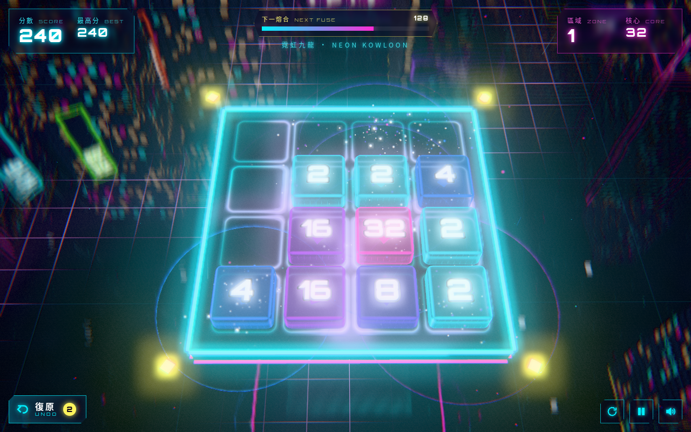

# 數據熔合 DATA FUSE

> 賽博朋克 3D 數字合併解壓遊戲 · cyberpunk 3D merge puzzle · Three.js · 手機優先

**試玩 Play:** https://fung2222.github.io/data-fuse/ · **自動示範 Demo:** https://fung2222.github.io/data-fuse/?demo=1



## 玩法 How to play
- 喺畫面任何位置**滑動**（或用方向鍵 / WASD），所有數據方塊會一齊滑向嗰邊。
- 兩粒相同數字嘅方塊相撞就會**熔合**成雙倍。每次熔合都有衝擊波同音效。
- 冇時間限制。慢慢諗，放鬆一下。
- 熔出 128、256、512… 會進入新**區域**，城市換色，仲會送你一次復原。
- **復原 UNDO**：每局有 2 次免費，最多倒返 3 步。用完可以補充（網頁版免費；App 版用自願觀看嘅獎勵廣告）。
- 冇得郁就「系統飽和」，可以倒帶 3 步繼續，或者再嚟一鋪。
- **無盡模式**：冇「過關」終點。每次熔出新嘅倍數（128、256 … 131072 之後繼續 262144、524288…）都係新區域，永遠有下一個目標。2048 之後新方塊出 4 嘅機會每區 +1%（上限 20%），難度慢慢加但一直玩得落去。最強核心同最遠區域會記錄為無盡紀錄。

## 語言 Language
遊戲支援**繁體中文（香港）**同 **English**，喺主畫面或暫停畫面撳「EN／中」切換，會記住你嘅選擇（`localStorage cyber.lang`，所有 CYBER 遊戲共用）。網址加 `?lang=en` / `?lang=zh` 亦可。

## English
**DATA FUSE** is a relaxing cyberpunk 3D merge puzzle. Swipe anywhere (or use the arrow keys) to slide every glowing data cube; two equal cubes fuse into double. No timer — take your time. **Endless mode:** there is no "you win" screen — every new power of two from 128 upward opens a new district forever (beyond 131072 the zones keep coming), each with a colour shift and an undo bonus; past 2048 the 4-spawn chance creeps up 1 % per zone (capped at 20 %). Best core and best zone are saved. Undo up to 3 steps; rewind 3 steps on game over. Bilingual (Traditional Chinese / English) with an in-game toggle.

## 操作 Controls
| 動作 Action | 手機 Touch | 鍵盤 Keyboard |
|---|---|---|
| 移動 Move | 滑動 Swipe | ↑↓←→ / WASD |
| 復原 Undo | 復原掣 | Z / U / Backspace |
| 暫停 Pause | ⏸ | P / Esc |
| 靜音 Mute | 🔊 | M |
| 新一局 New game | ⟳ | R |

## 網址參數 URL flags
`?demo=1` AI 自動玩 · `?lang=en|zh` · `?seed=123` 固定隨機種子 · `?fps=1` 顯示 FPS · `?quality=low|med|high` · `?adsim=1` 模擬廣告流程 · `?reset=1` 清除本機紀錄 · `?mute=1`

## 技術 Tech
- Three.js r169 + [cyber-kit](https://github.com/fung2222/cyber-kit) v0.2.1（`vendor/cyber-kit/`），純 ES modules，冇 build step。
- 所有資源打包喺 repo 入面，可以離線運行（適合包成 Android App）。
- 遊戲邏輯 `js/logic.js` 完全獨立於畫面，有單元測試。

## 開發 Development
```bash
cd ..   # repo 嘅上一層
python3 -m http.server 18940
# 開 http://127.0.0.1:18940/data-fuse/
node data-fuse/tests/logic.test.mjs        # 規則測試
node data-fuse/tests/ai.bench.mjs          # AI 基準
python data-fuse/tests/smoke.py            # 無頭瀏覽器測試 (Playwright)
```

## 文件 Docs
- [docs/HANDOFF.md](docs/HANDOFF.md) — 設計、調校常數、檔案地圖、測試、Android 打包、廣告位置
- [privacy.html](privacy.html) — 私隱政策 Privacy policy

屬於 [CYBER ARCADE](https://github.com/fung2222/cyber-arcade) 系列。
